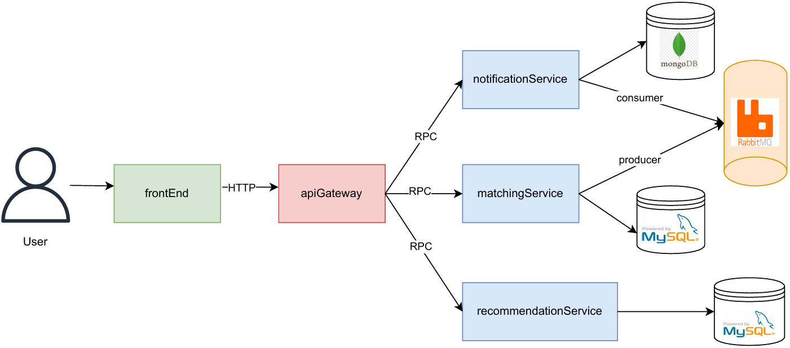
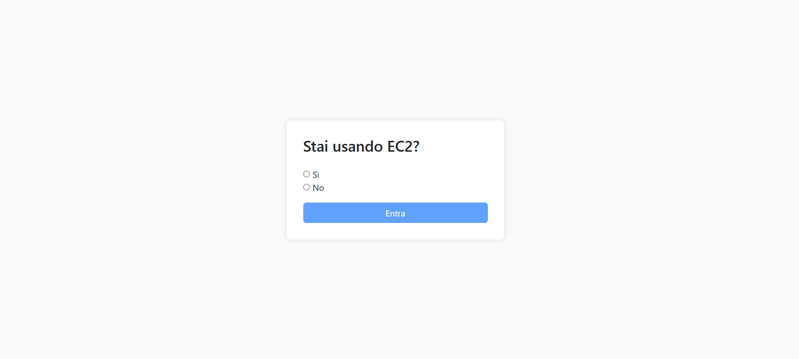
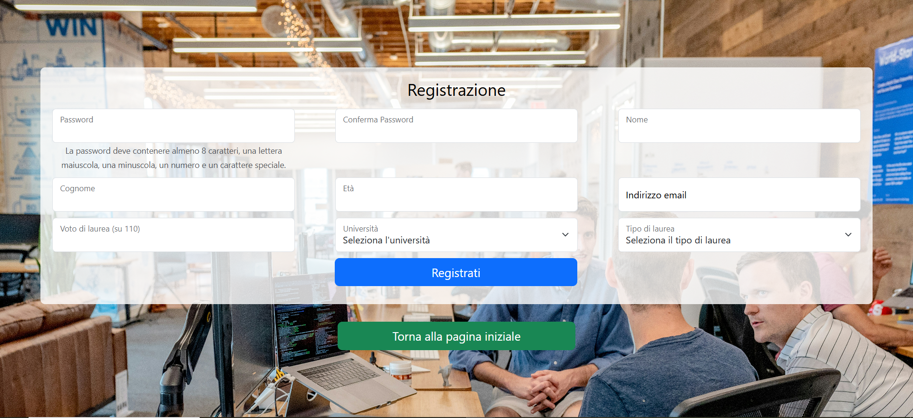
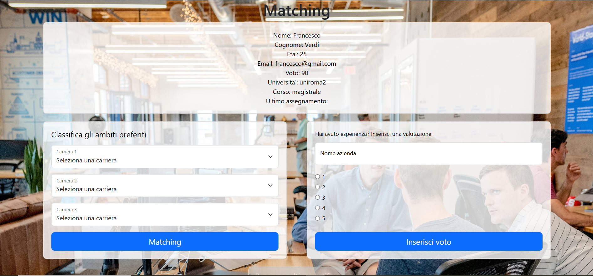
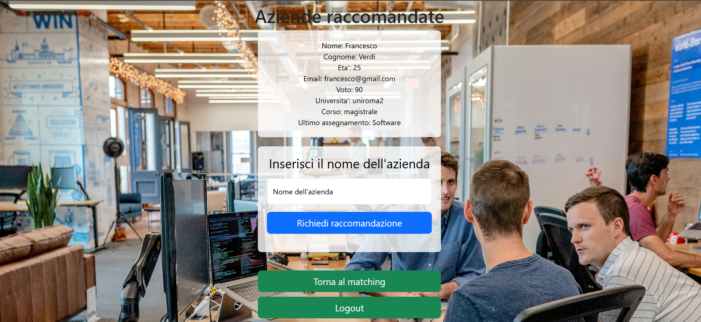

# Applicazione a microservizi
Il progetto prevede lo sviluppo di un'applicazione a microservizi. In particolare, l'applicazione è rivolta ad utenti laureati nelle università di Roma che vogliono trovare lavoro in ambito IT in base alle proprie preferenze (Cybersecurity, Software e Data science). Per realizzare ciò, l'applicazione prevede: un microservizio di matching sfruttando l'algoritmo Top Trading Cycle, un microservizio di raccomandazione di una determinata azienda richiesta dall'utente implementando una sorta di "collaborative filtering" ed un microservizio di notifica per l'utente, in modo che possa ricevere tramite email l'elenco delle aziende associate al determinato ambito IT risultante dall'algoritmo di matching. A supporto, l'applicazione prevede anche un servizio di api gateway ed un servizio di front end.
L'applicazione prevede principalmente l'orchestrazione di container tramite docker-compose, ma per uno sviluppo locale è possibile usare anche l'orchestrazione tramite kubernetes.



# Funzionamento
Il funzionamento dell'applicazione prevede la corretta installazione di Docker.
## Avvio dei container/pod (soluzione generale)
### Docker compose
Per funzionare con Docker Compose basta utilizzare seguenti comandi nella cartella del progetto:
```bash
docker-compose build
```
per eseguire il build, e poi avviare i container con:
```bash
docker-compose up
```
oppure usare direttamente un unico comando:
```bash
docker-compose up --build
```
e per fermare i container basta utilizzare il comando
```bash
docker-compose down
```
Se lo sviluppo è locale, una volta avviati i container l'applicazione si trova dal browser digitando
```bash
localhost:80
```

### Kubernetes (opzionale)
Nella progettazione del sistema, Kubernetes è stato utilizzato sfruttando l'estensione di Docker Desktop, quindi è stato usato solo per uno sviluppo locale. Per cui, una volta abilitata tale estensione, bisogna usare i comandi kubectl per utilizzare Kubernetes.
Per prima cosa, bisogna fare il build delle immagini e, per minimizzare i comandi da utilizzare, si possono costruire le varie immagini utilizzando sempre Docker Compose, per cui:
```bash
docker-compose build
```
Successivamente, bisogna sottolineare che l'applicazione utilizza dei database precaricati che sono presenti nella cartella mySql/init del progetto. Mentre in Docker Compose tali database vengono utilizzati in automatico dal container di mySql al primo avvio, in Kubernetes c'è bisogno di una configurazione. Per cui, per prima cosa, bisogna creare una configMap con il seguente comando:
```bash
kubectl create configmap mysql-init-scripts --from-file=./mySql/init/matchingDB.sql --from-file=./mySql/init/recommendationDB.sql
```
fatto ciò, si possono avviare i pod utilizzando il comando:
```bash
kubectl apply -f K8s/ --recursive
```
in modo da andare ad eseguire tutti i file yaml nelle varie sottocartelle della cartella K8s.
Per fermare i vari pod, si può usare il seguente comando:
```bash
kubectl delete deployments --all
```
Nello sviluppo locale, l'applicazione si trova dal browser digitando
```bash
localhost:30085
```

## Utilizzo dell'applicazione (+ Screenshot)
L'applicazione si presenta con una prima schermata che serve per capire se il deployment stato fatto su Ec2 oppure no. In caso in cui il deployment sia stato fatto su una macchina virtuale di Ec2, bisogna rispondere "Sì" ed inserire l'IP pubblico della macchina virtuale (nel formato ipv4).

A questo punto si entra nell'applicazione vera e propria con una schermata in cui è possibile fare il login se un utente è già registrato. Se si vuole provare l'applicazione un utente presente nel database è mail: francesco@gmail.com [MEMO: mail inventata e non esistente], password: Ciccio.80.

altrimenti è possibile premere su "Iscriviti" e registrarsi usando il seguente form:

In aggiunta, dalla schermata principale è possibile anche accedere alla schermata per aggiungere una nuova azienda nel sistema (funzionalità pensata per le aziende)

Una volta entrati come utente loggato ci si trova di fronte alla seguente schermata. I tasti di re-invio della notifica e di accesso alla funzionalità di raccomandazione sono disattivati se un utente non ha mai fatto un matching. A questo punto compilando gli appositi campi, un utente può eseguire l'algoritmo di matching e può anche votare un'azienda (tra quelle presenti nel sistema, infatti comparirà un menu a tendina per mostrare le aziende che è possibile votare. Per semplicità, le aziende presenti nel database sono tutte del tipo Azienda 1, Azienda 2,...fino ad Azienda 100). Appena eseguito il matching, l'utente riceverà tramite mail l'elenco delle aziende.

Infine l'ultima schermata riguarda la possibilità di capire se un'azienda è raccomandata o no per l'utente che richiede il consiglio

### Deployment su Ec2
Per fare il deployment dell'applicazione su una macchina virtuale del servizio Ec2 bisogna seguire vari passaggi. In primo luogo bisogna accedere ad AWS e andare a creare una macchina virtuale. Si consiglia una macchina virtuale almeno di taglia t3.small con sistema operativo Amazon Linux. Inoltre, le porte che bisogna aprire della macchina virtuale sono la porta 20 per il traffico SSH, la porta 80 per il traffico http e anche la porta 31234 usando la regola tcp personalizzata nella configurazione di sicurezza (serve per il funzionamento dell'applicazione).
Per connettersi alla macchina virtuale tramite terminale bisogna usare il comando
```bash
ssh -i <file.pem> ec2-user@<Public IP Ec2>
```
Successivamente per configurare appositamente la macchina virtuale bisogna:
aggiornare i pacchetti del sistema
```bash
sudo yum update -y
```
installare Docker
```bash
sudo yum install docker -y
```
scaricare Docker compose e rendere eseguibili i relativi file
```bash
sudo curl -L "https://github.com/docker/compose/releases/latest/download/docker-compose-$(uname -s)-$(uname -m)" -o /usr/local/bin/docker-compose
sudo chmod +x /usr/local/bin/docker-compose
```
Poi bisogna copiare il progetto sdccProject dentro la macchina virtuale, e successivamente bisogna entrare nella cartella mySql del progetto per modificare i permessi della cartella (questo passaggio serve a consentire al container di mySql di montare i database), e questo si può fare con i comandi
```bash
cd /home/ec2-user/sdccProject/mySql
chmod 755 init
chmod 644 init/*.sql
```
A questo punto bisogna avviare Docker, per cui eseguire il comando
```bash
sudo systemctl start docker
```
A questo punto bisogna fare il build ed avviare i container, per cui da dentro la cartella sdccProject eseguire il comando
```bash
sudo docker-compose up --build
```
Dal proprio browser l'applicazione girerà all'indirizzo usato con l'Ip della macchina Ec2
```bash
http://<Public Ip Ec2>
```


